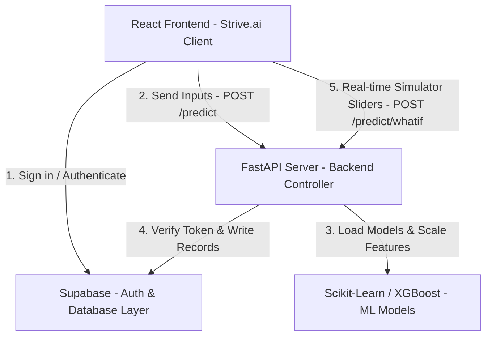

# Strive.ai - Interactive Academic Performance Predictor & Goal Planner

**Strive.ai** (formerly OptiStudy) is a machine learning-driven web application designed to forecast semester outcomes, predict course grades, evaluate academic failure risks, and generate customized study plans for university students. 

The application utilizes a **three-tier client-server architecture** comprising a React + Vite frontend, a FastAPI backend server hosting trained Random Forest and XGBoost models, and a Supabase PostgreSQL database layer.

---

## 🚀 Key Features

* **Real-time Course Grade Predictions**: Predicts numeric final marks and letter grades on the standard Nigerian university 5.0 scale using a Random Forest Regressor.
* **XGBoost Risk Classifier**: Group students into academic risk levels (`Low Risk`, `Medium Risk`, `High Risk`) to flag early warnings.
* **Interactive What-If Simulator Sandbox**: Real-time sliders allow students to manipulate continuous assessment (CA) variables (study hours, class attendance) to visualize immediate grade projections.
* **Course-Specific Confidence Levels**: Displays prediction confidence meters side-by-side with interactive slider rows.
* **Target GPA & AI Goal Planner**: Set a target GPA for the semester and receive a custom, step-by-step roadmap indicating upgrade tasks and study targets to hit that GPA.
* **Secure Database Archiving**: Save and log simulation historical outcomes to a PostgreSQL backend using Supabase Auth (JWT verification).
* **Fully Responsive Design**: Premium glassmorphic interface supporting dynamic dark/light themes.

---

## 🛠️ System Architecture



---

## 📊 Mathematical Foundations

### 1. Continuous Assessment (CA) Calculation
Continuous Assessment is computed using weighted variables:
* **Attendance ($A$)**: $0 \le A \le 100\%$ (normalized to a 10-point scale)
* **Midterm ($M$)**: $0 \le M \le 15$ marks
* **Assignments ($As$)**: $0 \le As \le 10$ marks
* **Quizzes ($Q$)**: $0 \le Q \le 5$ marks

$$CA = \left(\frac{A}{10}\right) + M + As + Q$$
$$CA_{\text{scaled}} = \left(\frac{CA}{40}\right) \times 100$$

### 2. Projected GPA Formula
Projected Semester GPA is calculated across all credit units:
$$GPA = \frac{\sum_{i=1}^{n} (GP_i \times U_i)}{\sum_{i=1}^{n} U_i}$$
* $GP_i$ = Predicted grade point of course $i$ ($0.0 \text{ to } 5.0$)
* $U_i$ = Credit units of course $i$ ($1 \text{ to } 4$)

---

## 💻 Setup and Installation

### 1. Database Setup (Supabase)
Create two tables in your Supabase database: `profiles` and `academic_records`. 

Execute the following commands in your **Supabase SQL Editor** to configure tables and Row Level Security (RLS) policies:

```sql
-- Create Profiles Table
CREATE TABLE public.profiles (
    id UUID PRIMARY KEY REFERENCES auth.users(id),
    matric_number TEXT UNIQUE NOT NULL,
    full_name TEXT NOT NULL,
    school_email TEXT UNIQUE NOT NULL,
    created_at TIMESTAMP WITH TIME ZONE DEFAULT NOW()
);

-- Create Academic Records Table
CREATE TABLE public.academic_records (
    id UUID PRIMARY KEY DEFAULT gen_random_uuid(),
    student_id UUID REFERENCES public.profiles(id),
    semester TEXT NOT NULL,
    course_name TEXT NOT NULL,
    hours_studied NUMERIC NOT NULL,
    previous_scores NUMERIC NOT NULL,
    extracurricular INTEGER NOT NULL,
    sleep_hours NUMERIC NOT NULL,
    course_difficulty INTEGER NOT NULL,
    course_unit INTEGER NOT NULL,
    attendance NUMERIC NOT NULL,
    midterm_score NUMERIC NOT NULL,
    assignment_score NUMERIC DEFAULT 0.0,
    quiz_score NUMERIC DEFAULT 0.0,
    ca_score NUMERIC NOT NULL,
    predicted_score NUMERIC NOT NULL,
    grade TEXT NOT NULL,
    risk_label INTEGER NOT NULL,
    recommendation TEXT NOT NULL,
    created_at TIMESTAMP WITH TIME ZONE DEFAULT NOW()
);

-- Enable RLS Policies
ALTER TABLE public.profiles ENABLE ROW LEVEL SECURITY;
ALTER TABLE public.academic_records ENABLE ROW LEVEL SECURITY;

-- Policies for Authenticated Writes
CREATE POLICY "Allow users to manage their own profile" ON profiles FOR ALL TO authenticated USING (auth.uid() = id) WITH CHECK (auth.uid() = id);
CREATE POLICY "Allow users to manage their own records" ON academic_records FOR ALL TO authenticated USING (auth.uid() = student_id) WITH CHECK (auth.uid() = student_id);
```

### 2. Backend Setup (FastAPI)
1. Navigate to the backend directory:
   ```bash
   cd backend
   ```
2. Create and activate a Python virtual environment:
   ```bash
   python -m venv venv
   source venv/bin/activate  # On Windows: venv\Scripts\activate
   ```
3. Install Python dependencies:
   ```bash
   pip install -r requirements.txt
   ```
4. Create a `.env` file inside the backend directory:
   ```env
   SUPABASE_URL=https://your-supabase-project.supabase.co
   SUPABASE_ANON_KEY=your-supabase-anon-key
   ```
5. Start the FastAPI development server:
   ```bash
   uvicorn main:app --reload
   ```
   *The server runs locally at: `http://127.0.0.1:8000`*

### 3. Frontend Setup (React + Vite)
1. Navigate to the frontend directory:
   ```bash
   cd frontend
   ```
2. Install npm packages:
   ```bash
   npm install
   ```
3. Create a `.env` file inside the frontend directory:
   ```env
   VITE_SUPABASE_URL=https://your-supabase-project.supabase.co
   VITE_SUPABASE_ANON_KEY=your-supabase-anon-key
   ```
4. Start the Vite React development server:
   ```bash
   npm run dev
   ```
   *The client web portal runs locally at: `http://localhost:5173`*

---

## 📁 Repository Structure

```text
├── backend/
│   ├── main.py              # FastAPI Server routing & API Controllers
│   ├── supabase_client.py   # Auth validation and Supabase REST wrappers
│   ├── utils.py             # CA formulas & Dynamic Recommendation Engine
│   └── requirements.txt     # Python backend dependencies
├── frontend/
│   ├── src/
│   │   ├── App.jsx          # React Main SPA Component (Dashboard & Goal Planner)
│   │   ├── App.css          # Styled stylesheets (Responsive layout grid system)
│   │   └── main.jsx         # App bootstrapping
│   ├── index.html           # Rebranded HTML Template file
│   └── package.json         # NPM package dependencies configuration
├── model/
│   ├── train_model.py       # ML Pipeline training logic (SMOTE, Scaling, Fit)
│   ├── rf_reg.pkl           # Trained Random Forest Regressor
│   └── xgb_clf.pkl          # Trained XGBoost Classifier
└── README.md                # Project documentation manual
```

---

## 🎓 Project Credits
* **Author**: Patrick Scarborough
* **Project Title**: Design and Implementation of an Academic Performance Predictor using Machine Learning Models (Random Forest and XGBoost)
* **Institution Standard**: 5.0 CGPA Scale (Nigerian University System)
