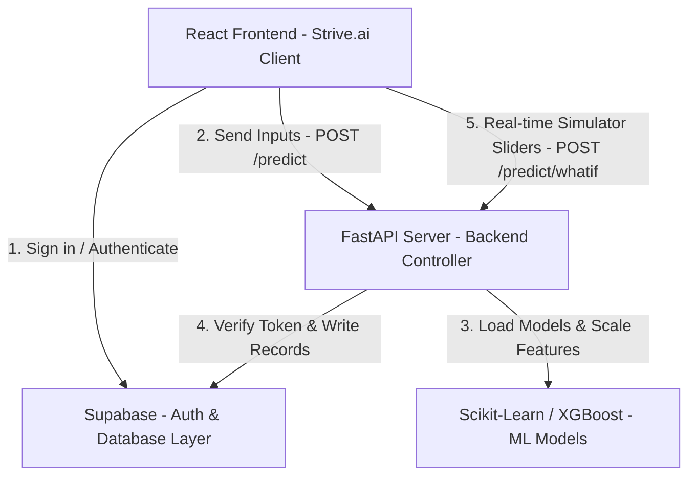

# Thesis Chapter 4: System Implementation, Results, & Discussion

This document compiles the technical details, database schemas, system architecture, and mathematical formulations of **Strive.ai** (formerly OptiStudy) for use in your final year project (FYP) thesis report.

---

## 1. System Architecture & Component Interactions
The system utilizes a **three-tier client-server architecture** composed of the frontend client, backend application server, and the backend-as-a-service database layer.



### Technology Stack Justification
1. **Frontend (React + Vite)**: Chosen for rapid hot module replacement (HMR), component-driven UI architecture, and modern glassmorphic visual presentation suitable for an interactive web dashboard.
2. **Backend (FastAPI)**: Selected for its high performance (powered by Starlette and Uvicorn), built-in Pydantic data validation (guaranteeing type safety before passing arrays to ML models), and automatic OpenAPI (Swagger) documentation generation.
3. **Database & Auth (Supabase)**: Offers a hosted PostgreSQL database with native Row Level Security (RLS) and built-in GoTrue auth server, avoiding the complexity of hosting custom authentication servers.
4. **Machine Learning Model Host (Scikit-Learn & XGBoost)**: Custom trained Random Forest Regressors and XGBoost Classifiers are serialized via Python's `pickle` library, loaded into memory at startup, and accessed in real-time.

---

## 2. Mathematical Formulations & Data Processing

### Continuous Assessment (CA) Calculation
The Continuous Assessment (CA) score is calculated using weighted raw scores representing attendance, midterm tests, assignments, and quizzes.

Let:
* \(A\) = Attendance percentage (\(0 \le A \le 100\))
* \(M\) = Midterm exam score (\(0 \le M \le 15\))
* \(As\) = Assignment score (\(0 \le As \le 10\))
* \(Q\) = Quiz score (\(0 \le Q \le 5\))

The overall CA Score (\(CA\)) is defined as:
\[CA = \left(\frac{A}{10}\right) + M + As + Q\]
Where:
* Attendance is normalized to a 10-point scale (\(A/10\)).
* The maximum possible CA Score is \(10 + 15 + 10 + 5 = 40\) points.
* The CA score is mapped to a 100-point scale for feature input:
\[CA_{scaled} = \left(\frac{CA}{40}\right) \times 100\]

### Grade Point Average (GPA) Calculation
The projected Semester GPA is dynamically calculated across all entered courses based on predicted grade points and course credit units.

Let:
* \(n\) = number of courses
* \(GP_i\) = predicted grade point of course \(i\) (\(0.0 \le GP_i \le 5.0\))
* \(U_i\) = credit units of course \(i\) (\(1 \le U_i \le 4\))

\[GPA = \frac{\sum_{i=1}^{n} (GP_i \times U_i)}{\sum_{i=1}^{n} U_i}\]

### Academic Grading Scale (5.0 Scale)
Scores predicted by the Random Forest Regressor are mapped to Nigerian university grading conventions:

| Score Range (%) | Letter Grade | Grade Points (GP) | Classification |
| :--- | :---: | :---: | :--- |
| \(70 - 100\) | A | 5.0 | Excellent |
| \(60 - 69.9\) | B | 4.0 | Very Good |
| \(50 - 59.9\) | C | 3.0 | Good |
| \(45 - 49.9\) | D | 2.0 | Pass |
| \(40 - 44.9\) | E | 1.0 | Pass (Marginal) |
| \(0 - 39.9\) | F | 0.0 | Fail |

---

## 3. Dynamic Recommendation Engine Logic
To translate quantitative predictions into qualitative student support, Strive.ai integrates a rule-based **Recommendation Engine** that runs concurrently with model inference.

### 1. Risk and Target Study Allocation
The engine determines recommended study parameters based on the predicted risk level from the XGBoost classifier:
- **High Risk:** Recommends a minimum of **10 study hours/week** split across **4 sessions**, accompanied by an urgent study intervention alert.
- **Medium Risk:** Recommends **6 study hours/week** split across **3 sessions**, with guidance on reinforcing weak topics.
- **Low Risk / Stable:** Recommends **3 study hours/week** split across **2 sessions** to maintain grade consistency.

### 2. Normalized CA Weakness Diagnostic
To isolate which continuous assessment component is dragging down a student's grade, the engine normalizes the CA inputs to a standard $[0, 1]$ scale:
- \(\text{Attendance}_{norm} = A / 100.0\)
- \(\text{Midterm}_{norm} = M / 15.0\)
- \(\text{Assignment}_{norm} = As / 10.0\)
- \(\text{Quiz}_{norm} = Q / 5.0\)

The component containing the minimum normalized score is identified as the **primary academic bottleneck**:
\[\text{Weakest Area} = \arg\min \left( \text{Attendance}_{norm}, \text{Midterm}_{norm}, \text{Assignment}_{norm}, \text{Quiz}_{norm} \right)\]

### 3. Actionable Study Advice Generation
The engine outputs context-sensitive suggestions based on the identified bottleneck:
- **Attendance Bottleneck:** *"Your class attendance is your weakest CA area. Make sure to attend all lectures to grasp key concepts."*
- **Midterm Bottleneck:** *"Your midterm exam score is your lowest CA component. Focus on reviewing lecture slides and tutorial questions."*
- **Assignment Bottleneck:**
  - If score is 0: *"You have 0 marks in assignments. Ensure you submit all homework assignments to boost your CA score."*
  - If score is $>0$: *"Your assignment scores are dragging down your CA. Double-check your answers and consult the tutor for clarification."*
- **Quiz Bottleneck:**
  - If score is 0: *"You have 0 marks in quizzes. Take all upcoming quizzes and review quick check questions."*
  - If score is $>0$: *"Your quiz score is your weakest CA component. Practice solving problems under time constraints."*

The resulting text string is returned in the API payload under `recommendation` and rendered inline inside the student's dashboard card.

---

## 4. Database Schema Design (Supabase PostgreSQL)

### Table: `profiles`
Stores metadata linked to authenticated student users.

| Column Name | Data Type | Key / Constraint | Description |
| :--- | :--- | :--- | :--- |
| `id` | UUID | PRIMARY KEY, Ref: `auth.users(id)` | Linked to Supabase Auth login |
| `matric_number` | TEXT | UNIQUE, NOT NULL | Student's official ID |
| `full_name` | TEXT | NOT NULL | Full legal name |
| `school_email` | TEXT | UNIQUE, NOT NULL | School email address |
| `created_at` | TIMESTAMP | DEFAULT NOW() | Timestamp of profile registration |

### Table: `academic_records`
Stores the history of predictions and CA scores submitted by students.

| Column Name | Data Type | Key / Constraint | Description |
| :--- | :--- | :--- | :--- |
| `id` | UUID | PRIMARY KEY, DEFAULT `gen_random_uuid()` | Record primary key |
| `student_id` | UUID | FOREIGN KEY, Ref: `profiles(id)` | Submitting student |
| `semester` | TEXT | NOT NULL | e.g. "Year 4 Semester 1" |
| `course_name` | TEXT | NOT NULL | Course code |
| `hours_studied` | NUMERIC | NOT NULL | Study hours/week |
| `previous_scores` | NUMERIC | NOT NULL | Historical CGPA/score |
| `extracurricular` | INTEGER | NOT NULL (0 or 1) | Extracurricular status |
| `sleep_hours` | NUMERIC | NOT NULL | Average sleep hours/night |
| `course_difficulty`| INTEGER | NOT NULL (1 to 3) | Difficulty level |
| `course_unit` | INTEGER | NOT NULL (1 to 4) | Credit unit |
| `attendance` | NUMERIC | NOT NULL | Class attendance % |
| `midterm_score` | NUMERIC | NOT NULL | Midterm test score |
| `assignment_score`| NUMERIC | DEFAULT 0.0 | Optional assignment mark |
| `quiz_score` | NUMERIC | DEFAULT 0.0 | Optional quiz mark |
| `ca_score` | NUMERIC | NOT NULL | Calculated CA score |
| `predicted_score` | NUMERIC | NOT NULL | Model predicted final score |
| `grade` | TEXT | NOT NULL | Grade letter |
| `risk_label` | INTEGER | NOT NULL (0 = Low, 1 = Med, 2 = High) | XGBoost Risk Level |
| `recommendation` | TEXT | NOT NULL | Custom advice generated |
| `created_at` | TIMESTAMP | DEFAULT NOW() | Record timestamp |

### Row Level Security (RLS) Policy Configurations
Security is enforced at the database level to protect private student information:
```sql
-- Enforce RLS on tables
ALTER TABLE public.profiles ENABLE ROW LEVEL SECURITY;
ALTER TABLE public.academic_records ENABLE ROW LEVEL SECURITY;

-- Policy example: Select restriction
CREATE POLICY "Users can view their own academic records" 
ON public.academic_records
FOR SELECT USING (auth.uid() = student_id);
```

---

## 5. API Endpoint Configurations (FastAPI Routing)

| Endpoint | HTTP Method | Request Body | Protected (Auth)? | Description |
| :--- | :---: | :--- | :---: | :--- |
| `/health` | GET | None | No | Server connectivity check |
| `/predict` | POST | `{ courses: [...] }` | No | Computes grades, GPA, and recommendations for multiple courses |
| `/predict/whatif`| POST | `CourseInput` | No | Runs prediction and recommendation logic for a single course (slider updates) |
| `/profile` | POST | `ProfileInput` | **Yes** (JWT Bearer) | Registers/updates student profile |
| `/history` | POST | `{ semester, records: [...] }`| **Yes** (JWT Bearer) | Archives semester results to DB |
| `/history` | GET | None | **Yes** (JWT Bearer) | Fetches past semester history logs |

---

## 6. Security & Domain Validation Control
To secure the system from unauthorized public registration, the React signup flow employs client-side regular expression (regex) domain filters:

* **Validation Constraint Rule:** The signup email must belong to an official university email domain.
* **Regex Pattern:** `/^[a-zA-Z0-9._%+-]+@[a-zA-Z0-9.-]+\.edu(\.[a-zA-Z]{2,})?$/`
* **Vulnerability Analysis Note:** OAuth 2.0 logins (e.g. Sign In with Google) can bypass standard client-side signup forms unless domain limits are restricted in the OAuth provider dashboard (e.g. Supabase Allowed Domains list) or validated in the auth listener middleware. Removing public federated login providers mitigates this bypass vector.

---

## 7. Results Discussion: What-If Simulator & Dynamic Recommendation Loop

One of the key contributions of the **Strive.ai** portal is its **Interactive What-If Simulation Engine & Dynamic Recommendation Loop**:

1. **Student Agency & Persuasive Design:** Instead of presenting static predictions (which can demotivate students), the portal allows students to actively interact with the predictive parameters. By sliding study hours or simulating improved class attendance, students get immediate visual feedback on their potential academic trajectory.
2. **Real-time Closed-Loop Feedback:** As a student drags the `Study Hours / Week` slider:
   - The frontend triggers a `POST` request to `/predict/whatif`.
   - The backend recalculates model inferences (Random Forest score & XGBoost risk index) and reruns the Recommendation Engine.
   - The frontend updates the predicted grade badge, risk tag, and the inline **AI Study Recommendation** details (advice text, target hours, and session splits) in real-time.
3. **Behavioral Impact Demonstration:** For instance, sliding study hours from `4` to `12` might transition a course from `High Risk (F)` to `Stable (B)`. The inline recommendation box dynamically reflects this change, moving from an urgent intervention warning (demanding 10 hours/week) to a maintenance guideline (suggesting 6 hours/week) and highlighting the specific bottleneck (e.g., quizzes) that the student should focus on next. This serves as an actionable, persuasive academic recommendation system.
